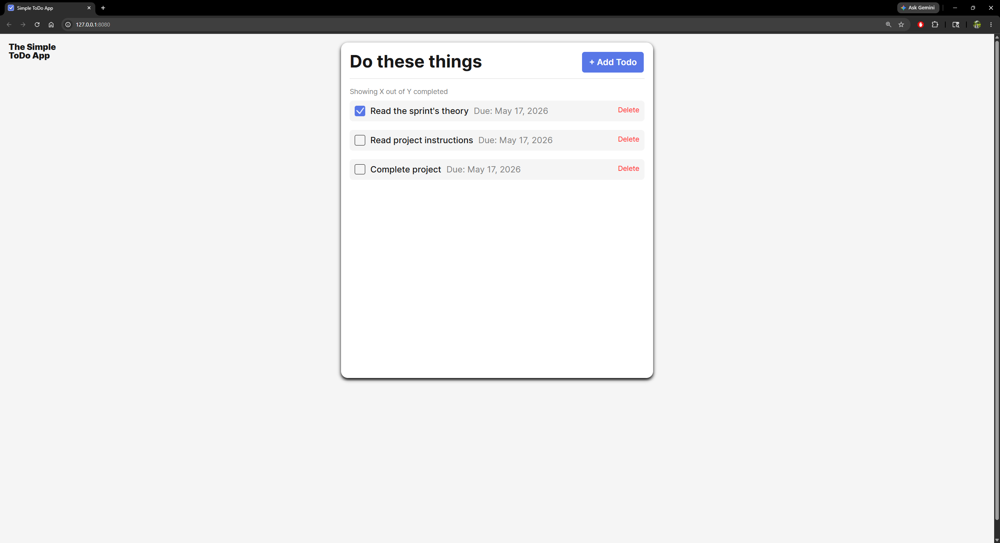
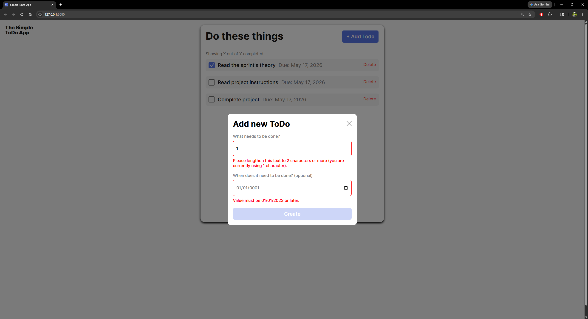
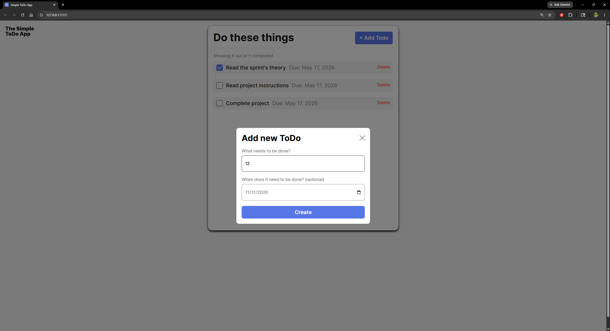
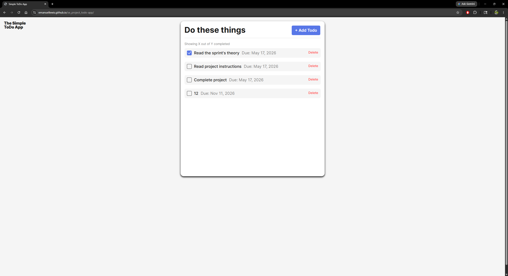

# Simple Todo App

Give a brief description of the project here. Feel free to give it a different name.

## Functionality

This project is a dynamic To-do application that allows users to create, complete, and delete tasks. The app includes form validation, popup interactions, and automatic date handling for each todo item. Tasks are rendered dynamically using JavaScript classes and object-oriented programming principles.

## Technology

- HTML5
- CSS3
- JavaScript (ES6 Modules)
- Object-Oriented Programming (OOP)
- DOM Manipulation
- Form Validation API
- UUID package for generating unique IDs
- Event Listeners and Dynamic Rendering

## Main Interface

---

## Form Validation Errors

---

## Successful Form Validation

---

## Todo List After Adding Tasks

## Deployment

This project is deployed on GitHub Pages:

- LINK HERE [https://emanuellewis.github.io/se_project_todo-app/]
